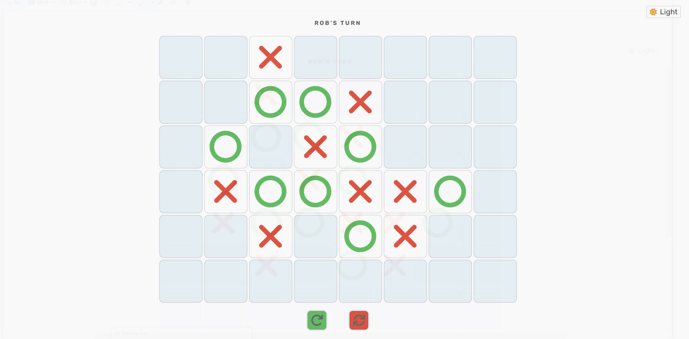

# XO game
---
## Rules
* Rules of "**noughts and crosses**" game: 
    + Select dimensions of game board (max: 10 x 10),
    + Select number of consecutive Noughts/or Crosses a player need to win (3, 4, or 5),
    + Be able to reset or restart the game after or during a game play.
    + Have not implemented  "***Player vs AI***" mode, so it is going to be the same as "***Player vs Player***" mode.
---
## Preview
#### I. Opening

#### II.  Form

#### II.  Playing

---